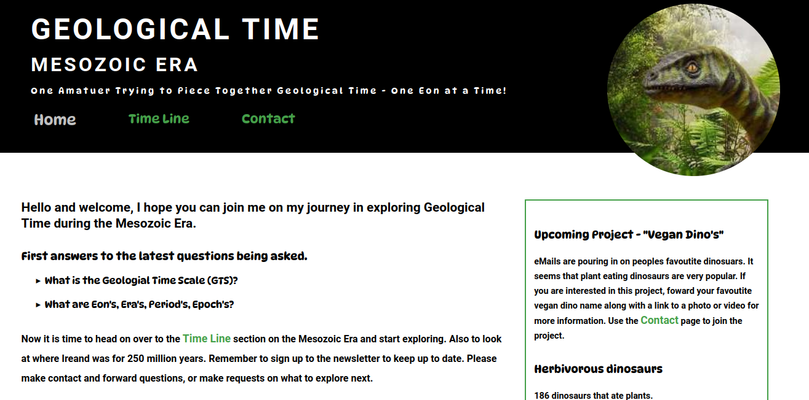
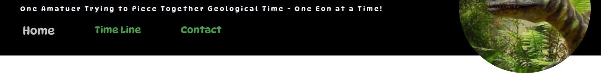
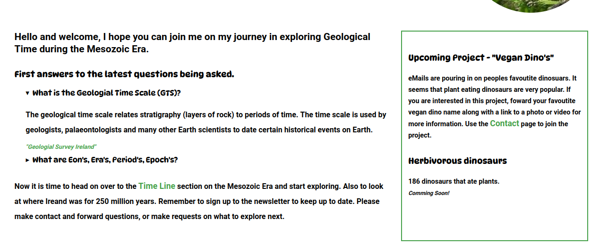

# Geological Time - Mesozoic Era     

After a trip and holiday to the Burren in 2020 it ignited an interest in Irish Geology. The site is a starting point to inspire people to explore Geology and Geology in Ireland. There is so much to explore in Geology and dinosuars are what most people are drawn to first. I hope to inspire people to sign up and help the site to grow and decide on what to explore next. Drip feed Irish Geology, as our sea shores and aprks are full of fossils to view in the open. It is hoped with the chosen color and font scheme it will capture people of all ages.        

    

##  Site Navigation   

### Header Navigation   

Basic and functional header navigation with acitivated css to highlight current page.   

   

### Footer Navigation   

Footer Navigation/Site Map to make it easier to navigate the site without the need to scrool to the top.    

    

## Main Intro   

Home page/main intro, showing popular question with interaction with the use of summary tags. Side bar showing on what is coming up next and popular. Links and credits to information sources. Highlighting Irish Geology Sites.    

    

## Footer Section    

Footer section for all pages. Making it easy to sign up for a newsletter, site navigation, giving credit to influencing sites and links to social media.    

[Footer](IMAGES_MD/Footer.png)     

## Suprises  
### Git Pull
Just getting ready for my first push with git, bit I was not allowed. I had to do a pull from the main repo. I had linked draw.io to my folder and had created a wireframe in the main repo. Hence the need for a pull before a push.

Using w3c validator for the first time not as bad as I expecting. Some corrections to form > legend. Also the quickest method for correcting flow issues with css. Finding missing closing tags.   

Now understand the full value of frequet git commits. Also keeps focus on one issue/task at a time.   

## New Learning Experiences  
###  New Languages   
HTML  
CSS  
Markdown   

### New Platforms  
Git  
GitHUb  
GitPod  
Draw.io  
Font Awesome  
w3 validator  

### Reseach and Sites to Credit   

#### Credits to Geological Sites    
[Geological Survey Ireland](https://www.example.com)   
[Big Think](https://bigthink.com/life/evolution-of-rainforests/)  
[Wiki Picture](https://commons.wikimedia.org/wiki/File:Pteranodon,_DinoPark_Ko%C5%A1ice.jpg)    

#### Credits to Sites who aided my coding.   
[CCS Tricks](https://css-tricks.com/)   
[W3Schools](https://www.w3schools.com/)   
[Markdown Guide](https://www.markdownguide.org/cheat-sheet/)   
[Google Fonts](https://fonts.google.com/)   
[Diagrams - Wireframe](https://app.diagrams.net/)   
[Freepik](<a href="https://www.freepik.com/free-vector/earth-map-scheme-isolated-white_27222641.htm#query=earth&position=1&from_view=search">Image by Upl56</a> on Freepik)      
   
   

## Things I would have like to have done and will do.  
Need to nail css postitioning.  

### Crash Courses to Take   
Web Color and just learning how to match colors.   
Design   
CSS Positioning   

## CCE Common Continous Errors (Bad Habits)   
Typo's  
Typo's  
Typo's  
Forgetting . or # in CSS   
Keep mixing up margin and padding.   
