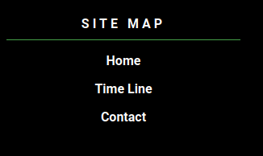
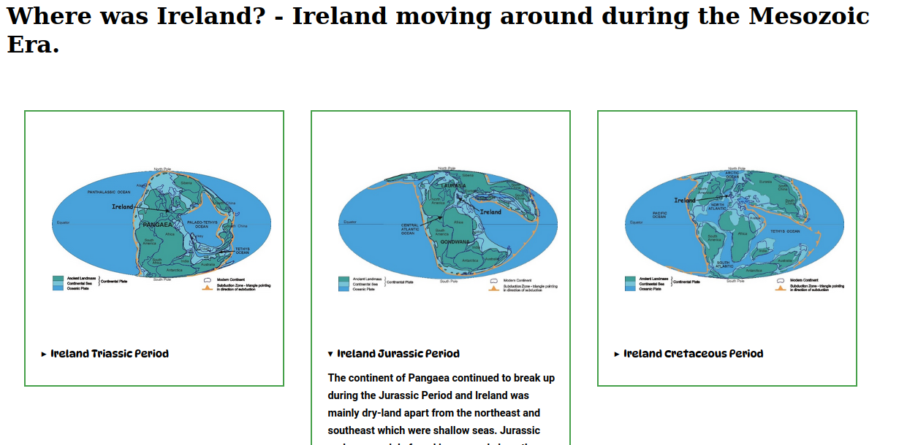

# Geological Time - Mesozoic Era     

After a trip and holiday to the Burren in 2020 it ignited an interest in Irish Geology. The site is a starting point to inspire people to explore Geology and Geology in Ireland. There is so much to explore in Geology and dinosaurs are what most people are drawn to first. I hope to inspire people to sign up and help the site to grow and decide on what to explore next. Drip feed Irish Geology, as our sea shores and  are full of fossils to view in the open. It is hoped with the chosen color and font scheme it will capture people of all ages.        

    

##  Site Navigation   

### Header Navigation   

Basic and functional header navigation with activated css to highlight current page.   

   

### Footer Navigation   

Footer Navigation/Site Map to make it easier to navigate the site without the need to scrool to the top.    

    

## Main Intro   

Home page/main intro, showing popular question with interaction with the use of summary tags. Side bar showing on what is coming up next and popular. Links and credits to information sources. Highlighting Irish Geology Sites.    

    

## Footer Section    

Footer section for all pages. Making it easy to sign up for a newsletter, site navigation, giving credit to influencing sites and links to social media.    

        

## Time Line    

Time Line page for exploring Mesozoic Era and where Ireland was.    

### Table   

Mesozic Time Line Table with information from Simple Wiki.

         
[Geological Time Line - Simple Wiki](https://simple.wikipedia.org/wiki/Geologic_time_scale)     

### Interactive Photos   

Interactive photos and text, showing where Ireland was during the Mesozoic Era.    

    
[Geological Survey Ireland](https://www.example.com)     

### Embedded Video    

Embedded Video showing Ireland throughout Geological Time.   

        
[Geological Survey Ireland](https://www.example.com)    

## Future Features   

Given more time, it would be nice to add more,   
- Interactive CSS photo gallery.   
- Interactive map showing sites of interest in Ireland.   
- Grow the table and make it more active with css pop outs.    

## Testing   

I did not start using html/css validator until half way through by project. On my next project I will be using it much sooner. It proved a very useful tool for error solving, and figuring out why my CSS was not working, because of missing tags and more.

### Validator Testing     

HTML error checking using jigsaw.w3.org.   

    

CSS error checking using validator.w3.org.    

     

### Unfixed Bugs    

More so still have to get more experience positioning and centering elements. More practice, practice and more practice. I spent some time trying out the website on several screen sizes, and work reasonably well. When I tried to down size it on the desktop browser (ctrl -) the sites starts to fall apart. Not something I had thought about when starting the site.

## Deployment     

Setting up the website on GitHub was a little different from the Code Institute tutorial. GitHub has a excellent help system, so no issues with the setup. A few corrections had to made to file paths but overall a successful deployment.

## Credits   

Any missed credits or mentions will be unintentional. There is no doubt at the beginning of anyone learning to code, it cannot be done without the vast resources and tutorials available.
  
### Credits to Geological Sites    
[Geological Survey Ireland](https://www.example.com)   
[Big Think](https://bigthink.com/life/evolution-of-rainforests/)  
[Wiki Picture](https://commons.wikimedia.org/wiki/File:Pteranodon,_DinoPark_Ko%C5%A1ice.jpg)    

### Credits to Sites who aided my coding.   
[CCS Tricks](https://css-tricks.com/)   
[W3Schools](https://www.w3schools.com/)   
[Markdown Guide](https://www.markdownguide.org/cheat-sheet/)   
[Google Fonts](https://fonts.google.com/)   
[Diagrams - Wireframe](https://app.diagrams.net/)   
[Freepik](https://www.freepik.com/)    
[Font Awesome](https://fontawesome.com/)     

